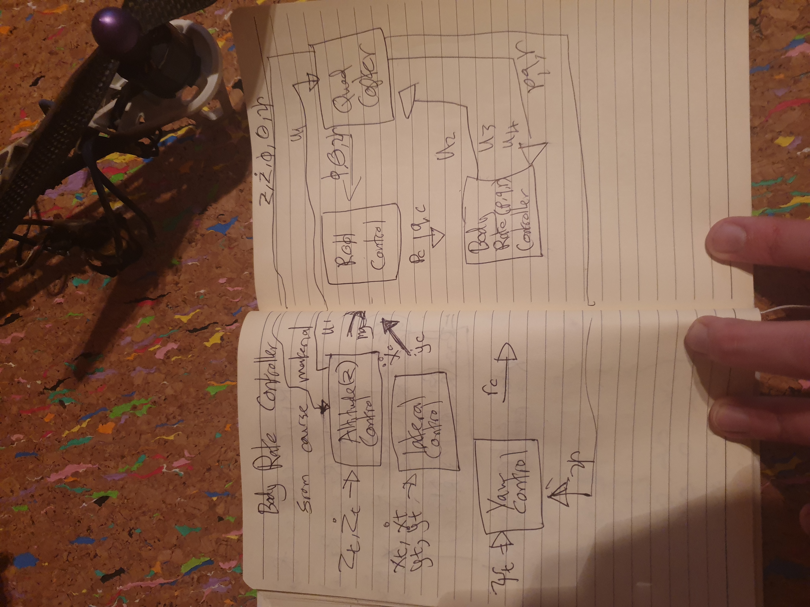
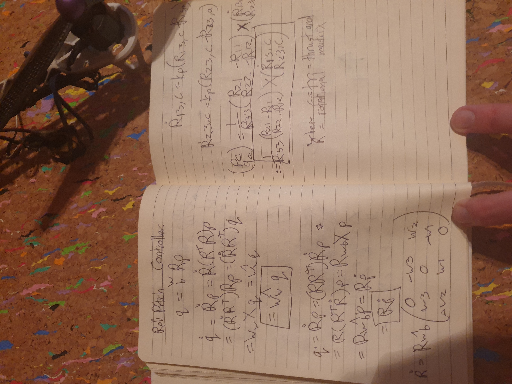
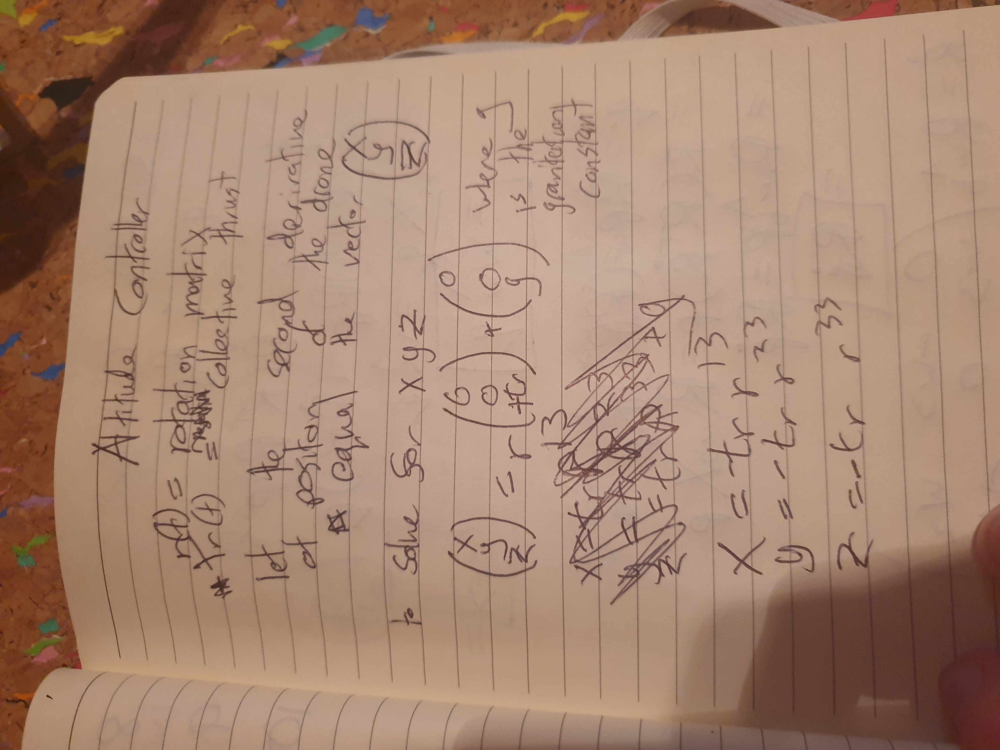
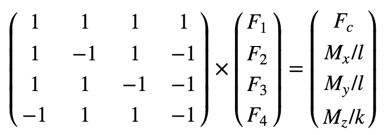

# Drone controller

This project uses cascading PID controllers to keep a drone in the air.

## Implemented body rate control in C++.

## BodyRate Controller
https://github.com/udacity/FCND-Controls/blob/solution/controller.py

The following are the notes i used with the python solution to write this function

### Implementation
In QuadControl.cpp on line 96 in the fuction QuadControl::BodyRateControl

##Implement roll pitch control in C++.

## RollPitch Controller

I used the following quations and again with the solution in python to write the function listed below

### Implementation
In QuadControl.cpp on line 115 in the function QuadControl::RollPitchControl.

## Implement altitude controller in C++.

## Altitude Controller
More notes

### Implementation
In QuadControl.cpp on line 160 in the function QuadControl::AltitudeControl.

## Implement lateral position control in C++.

## LateralPosition Controller

### Implementation
on line 191 in QuadControl.cpp in the function QuadControl::LateralPositionControl.
## Implement yaw control in C++.

## Yaw Controller

### Implementation
In QuadControl.cpp on line 238 in the function QuadControl::YawControl.

## Implement calculating the motor commands given commanded thrust and moments in C++.

## Control Inputs
The controller for the quad uses the collective thrust (Tr or c) and rotational moments (r) as inputs and those inputs are converted to each rotor thrust. (F1: front left, F2: front right, F3: rear left, F4: rear right)

### Implementation
 In QuadControl.cpp on line 58 in the function QuadControl::GenerateMotorCommands.

## C++ controller is successfully able to fly the provided test trajectory and visually passes inspection of the scenarios leading up to the test trajectory.

Ive included a video in the folder readmeMedia called exp.webm that shows the simulator working. Unfortunately My screen recorded on ubuntu constantly freezes and crashed when run with simulator.
---
